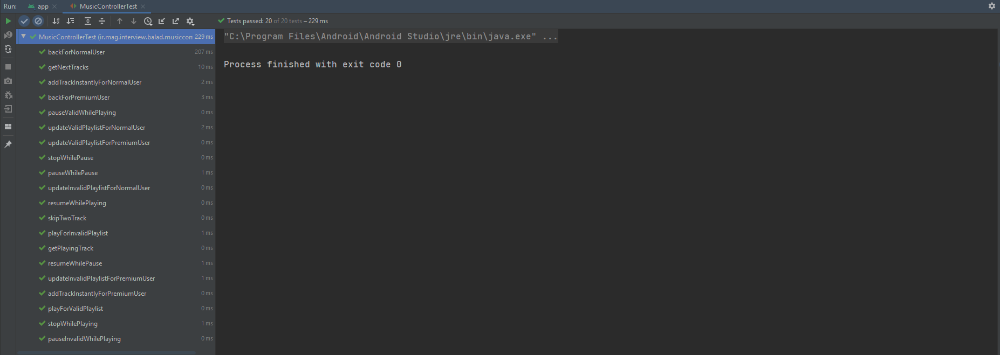

# Music Controller - Balad Interview

## 🔍 Overview

This report is for Balad interview task. The documentation of the tasks was a little ambiguous! Anyway, I tried to implement the program that makes sense. 

## 🔧 Implementation

Music Controller is the file that I handled the logic of this music player. I didn't have much time to put on the UI/UX side of the application and it seems that UI doesn't matter a lot based on the documentation. 

The Music Control is commented and you can find out each task in these comments. 

```kotlin
/**
 * [playingTrack] is for task number 1 to get the playing track.
 * It is live data and you can take the advantage of this.
 * Also you can not change the value from outside of the controller.
 */
val playingTrack: LiveData<Track> = _selectedTrack
val playlist: LiveData<List<Track>> = _playlist

init {
    _playlist.value = tracks
}

/**
 * [playOrResume] is implemented for task number 5 to play or resume the track.
 * It will return null if any errors occur.Else, It will return the playing track,
 * so that we can get the progress time by track. progress
 * Here we use a State design pattern to handle our states. for now two kinds of
 * state is available: playing, pause.
 */
fun playOrResume(): Track? {
    state.play()?.let {
        _selectedTrack.value = it
        return _selectedTrack.value
    }
    return null
}

/**
 * [pause] is implemented for task number 4 to pause the playing track by
 * giving the time.
 * Here we use a State design pattern to handle our states. for now two kinds of
 * state is available: playing, pause.
 */
fun pause(time: Long): Boolean {
    state.pause(time)?.let {
        _selectedTrack.value = it
        return true
    }
    return false
}
```

### LiveData

The playlist and playing track are integrated by Live Data, so we can take advantage of it outside of the class.

### States

As you see there is a state instance in Music Controller.

```kotlin
/**
 * In state design pattern we instantiate the states [pauseState] and
 * [playingState] then we should have a [state] field.
 */
val pauseState: PauseState = PauseState(this)
val playingState: PlayingState = PlayingState(this)
var state: IMusicState = pauseState
```

So maybe this is not necessary but to show I know the design pattern I used the state design pattern. So let's assume that some other states going to be added and the implementation may be changed. In this kind of implementation, we don't need any if condition and actually polymorphism going to handle it.

```kotlin
/**
 * [IMusicState] is our interface for a state design pattern.
 * Each one of our states should implement this interface.
 */
interface IMusicState {
    fun play(): Track?
    fun pause(time: Long): Track?
}
```

Like the big "Gum Ball" example, we add the actions to the interface and we going to have one class for each one of our states.

### Users

You should pass a user to the constructor. Because some decision is based on the user type. I predicted that we may have another kind of user in our application. So let's avoid if condition and make it cleaner!

```kotlin
/**
 * [MusicController] is responsible for music player logic.
 */
class MusicController(
    private val _user: IMusicUser,
    tracks: List<Track>
) {
}
```

I defined a user interface and two default user classes. So you can either use the classes or create your class that is implemented by this interface and then you can use it.

```kotlin
/**
 * [IMusicUser]
 * You can use [PremiumMusicUser] or [NormalMusicUser] to make [MusicController].
 * If you want your customized user model, you should implement this interface and
 * define the characteristic of that kind of user model.
 */
interface IMusicUser {
    fun updatePlaylist(tracks: List<Track>): List<Track>?
    fun back(tracks: List<Track>, playing: Track): Track?
    fun addTrackInstantly(tracks: List<Track>, track: Track, playing: Track): List<Track>?
}
```

Premium users and normal users are implemented in the way that the document said.

## 🧪 Tests

There is a Music Controller Test that I tested each one of the logic of the program. There are 20 tests.



## 🎨 View

The UI is just like what the document wanted. When the recycler is scrolled then it will go above the header. Also, I add some buttons and a switch for Normal/Premium to test some of the features interactively.


✍️ Mohammad Amin Ghasvari
